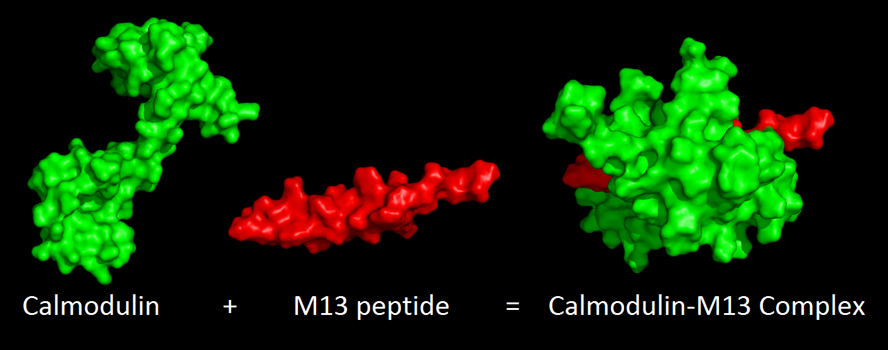
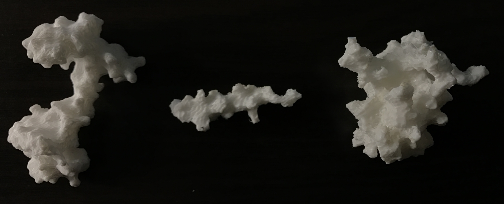

# Exploring 3D Printed Protein Structures

Embark on a captivating journey into the realm of 3D printed protein structures, a testament to the capabilities of my hobby 3D printer.

In this showcase, I present a demonstration of my printer's prowess in recreating protein structrues. The spotlight is on a personal favorite - Calmodulin. I have been working with Calmodulin for years. Renowned for its versatility, Calmodulin binds to an array of target peptides and proteins, including the illustrious M13 peptide. The Structures of the Calmodulin/M13 complex were rendered through PyMOL:

A unique challenge emerged - my 3D printer operates seamlessly with STL format model files, yet PyMOL faced limitations in exporting such files. I ended up to export the protein structures as VRML files, and then transformed into STL format using MeshLab. Here is the final 3D-printed structures:

Not to bad, right?

BTW, I subjected this page to ChatGPT, and it drafted the next paragraph for me. I have to say, I was impressed :)

*Admire the fusion of science, technology, and artistry in these printed masterpieces. The harmony between the digital and tangible is awe-inspiring, as these structures stand as a testament to human ingenuity and the convergence of diverse disciplines. As we gaze upon this achievement, let us celebrate the beauty of scientific exploration and the boundless potential of 3D printing technology. Indeed, a remarkable feat achieved with passion and precision - a true embodiment of "not too bad!"*