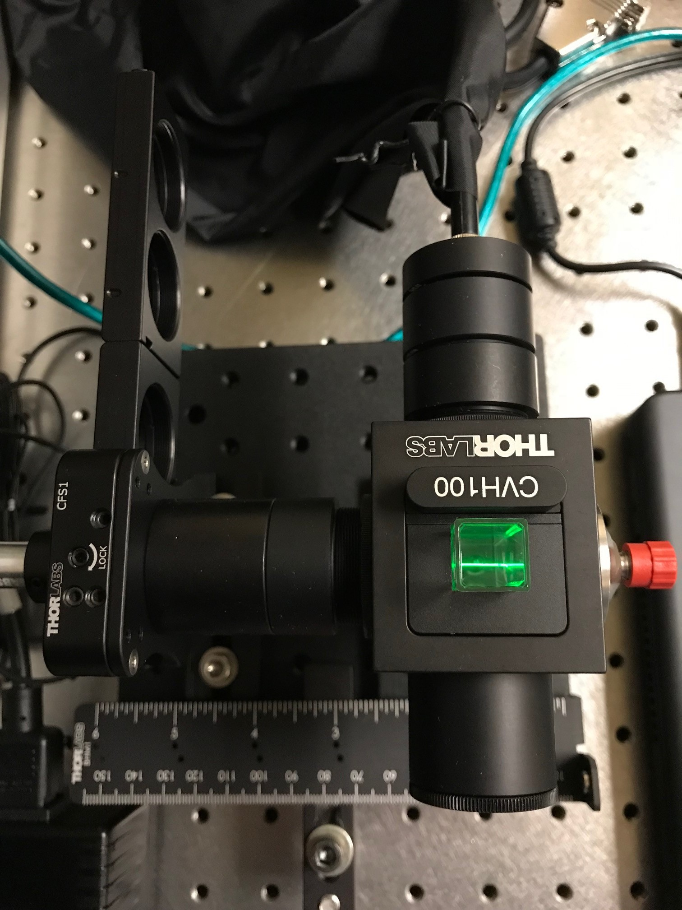
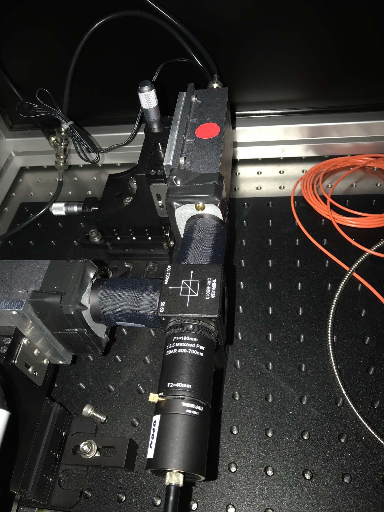
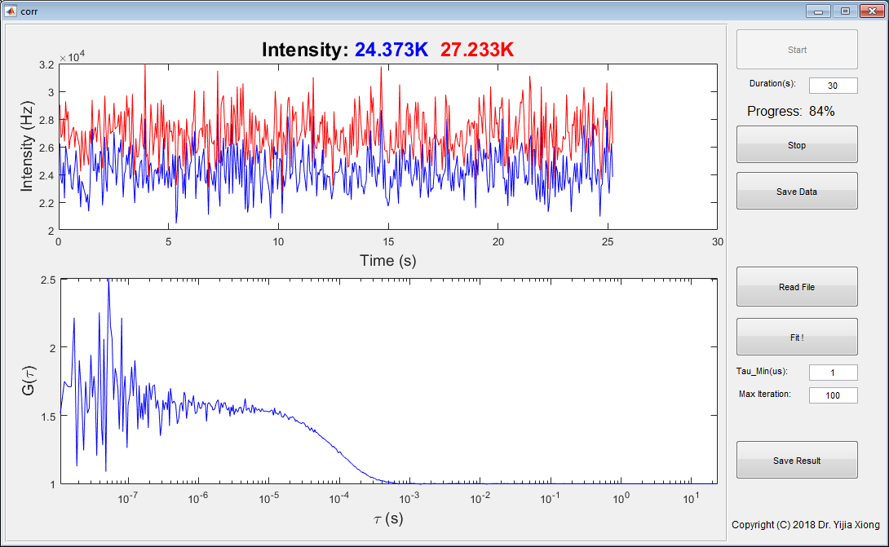
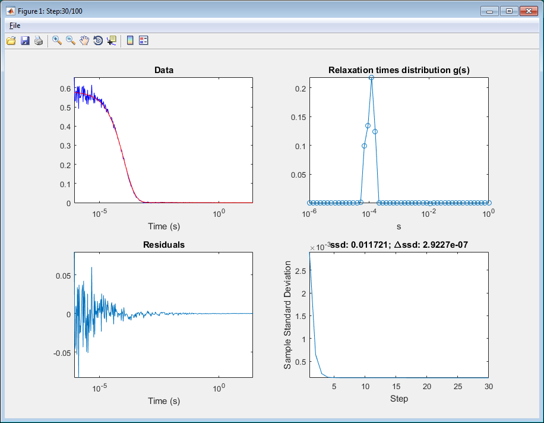
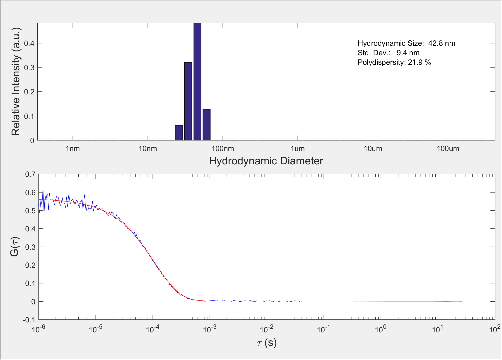

# Dynamic Light Scattering System
Dynamic light scattering (DLS) is a technique that can be used to determine the size distribution profile of small particles in suspension or polymers in solution. It measures the temporal fluctuations of the light scattering of a laser by the particles or macro molecules in the solution. Then the auto-correlation functions of the intensity are calculated and fitted to get the particles size distribution. The technique is also known as photon correlation spectroscopy or quasi-elastic light scattering. Auto-correlation is done by a hardware correlator. The fitting process is termed "inverse Laplace transform" which is a nontrival job. I use matlab to do the inverse Laplace transform fitting. Later, the data acquisition part was also integrated into the matlab script. Thus create a GUI with ease to use like a commercial software.

## Hardware
The DLS system is divided into tow subsystems: laser scattering subsystem and detection subsystem. These subsystems are connected by an multimode optical fiber. Here is the laser scattering system:

A rule was included when the picture was taken. It is a very compact system built around a cuvette holder.

This picture show the detection subsystem. It is comprised of optical fiber coupler, beam splitter and two avalanche diodes. Two avalanche diodes were used to avoid the afterpulse effect of the detection.

## Software
The gui of the software is straightforward and self-explained. 

During the fitting this dialog shows the progross of the regression:

Here is the measured DLS curve and the fitting result of a 42.9nm standard bead:
