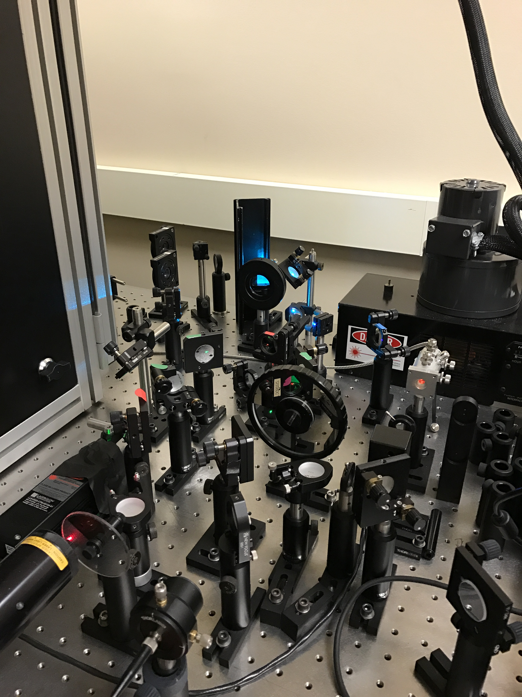
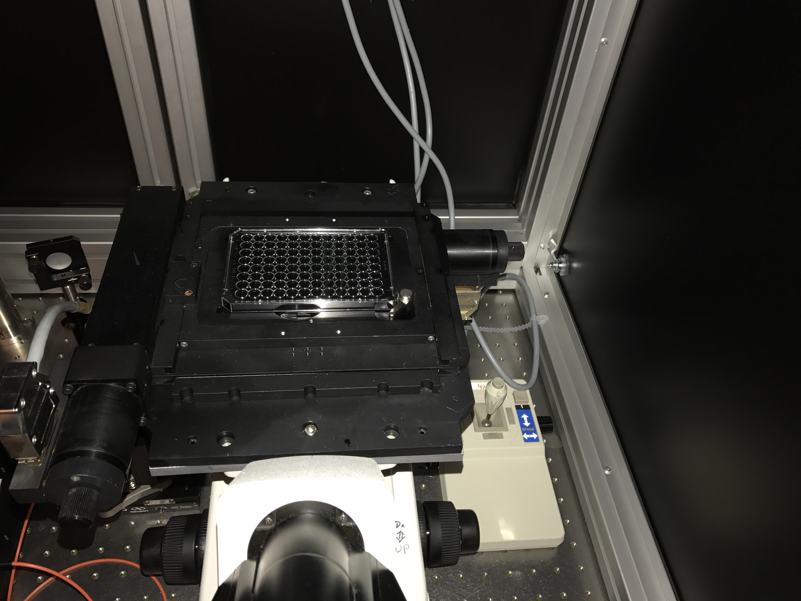
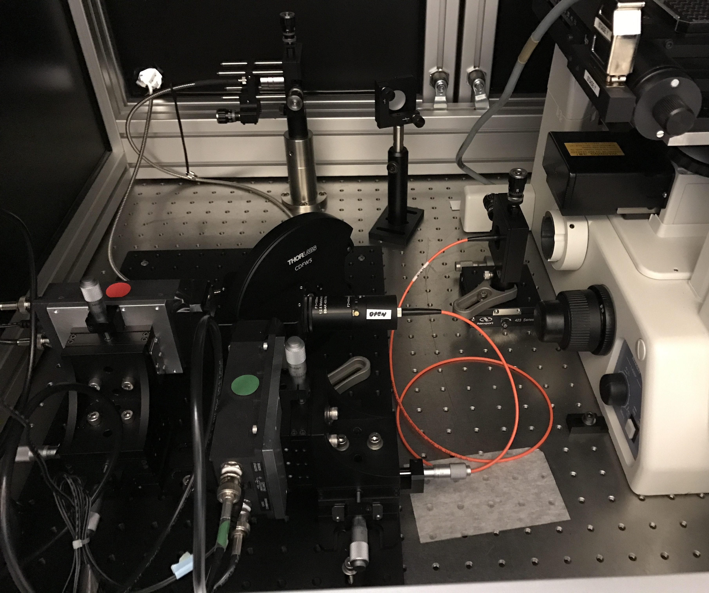
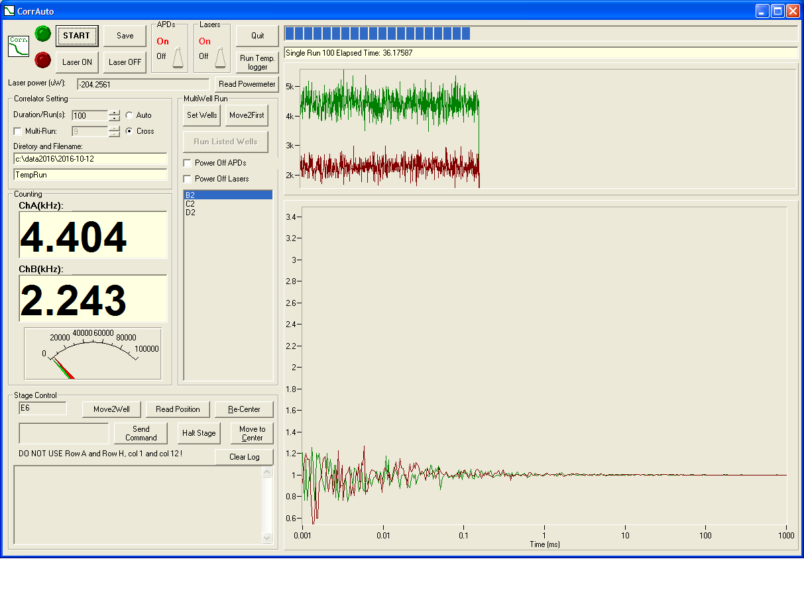
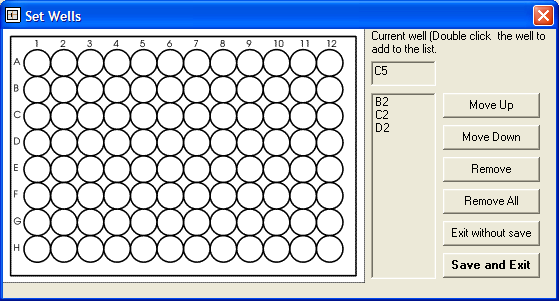
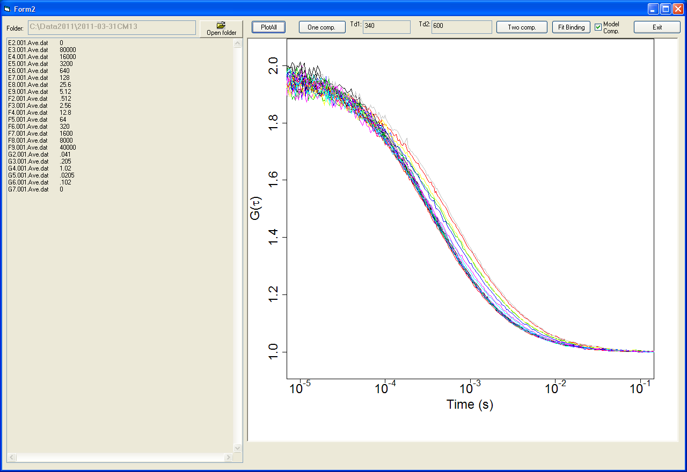
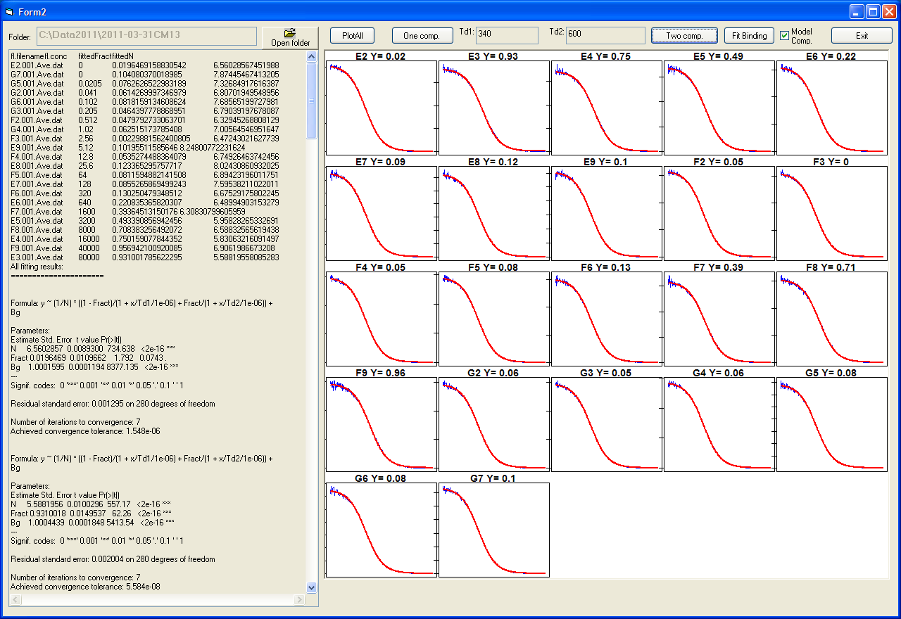
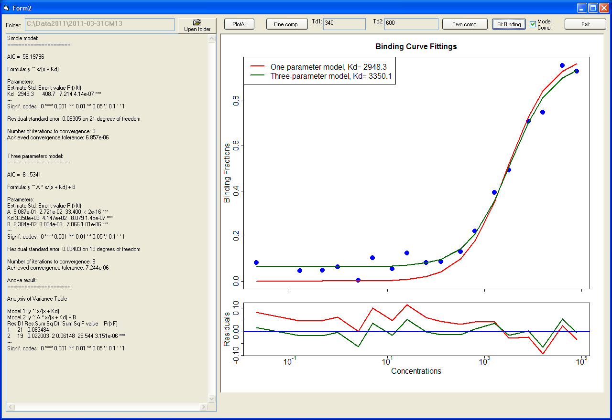
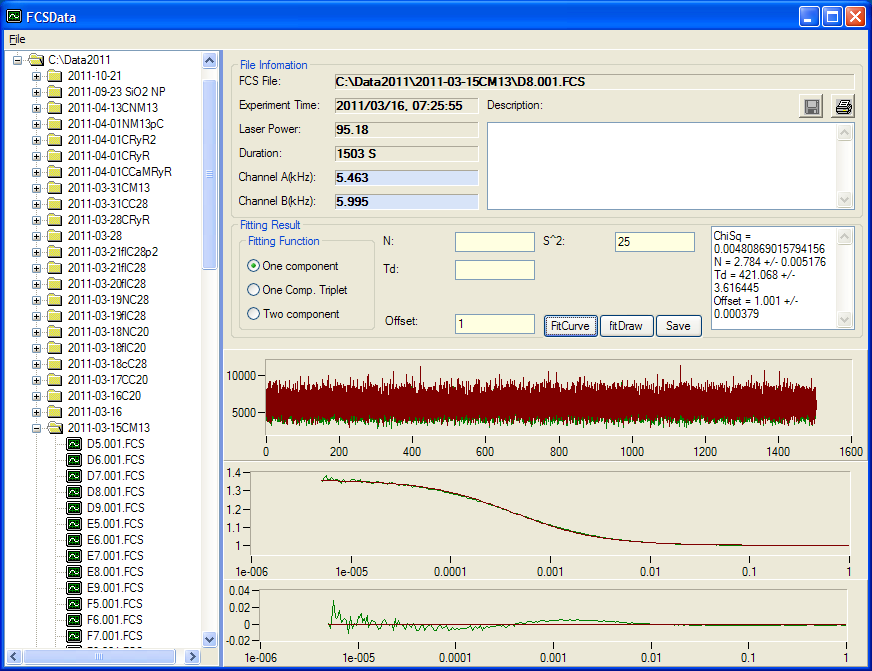
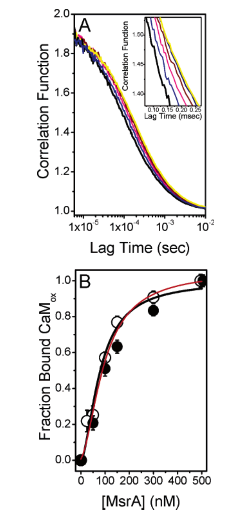

# Fluorescence Correlation Spectroscopy System
Fluorescence correlation spectroscopy (FCS)  is a correlation analysis of fluctuation of 
the fluorescence intensity. The analysis provides physical chemical parameters of the fluorphores. 
In biochemical research, they are often either a protein fused to a fluorescent protein or 
a fluorescent dye labeled biomolecules (protein, DNA/RNA, etc.). This FCS setup, both hardware
and software, was initially built for single sample measurement. Later it was upgraded to include 
an automated stage. This enabled the system to measure samples in microplate automatically. 
I also wrote the program to analyze the result of multiwell measurement.
## Hardware
The FCS system is based on a Nikon TE300 inverted microscope. I divided the system into three
subsystem: laser launch subsystem, inverted microscope and detection subsystem. These subsystems
were connected through optical fiber. This way the subsystem were only loosely coupled. Thus they can
be aligned separately and troubleshooting was much easier. Here is the overview of the setup. Notice 
the controllers on the roof shelf.

### Laser Launcher
Three laser was include in the laser launcher system: a 532nm Diode pumped solid state laser, a 632nm 
He-Ne laser and an air-cooled multiline Argon laser (major laser lines include 488nm and 514nm). With 
a combination of mirrors, prism, beam splitters and flip-flop mounts, I can manually choose any one 
of the four lasers, direct it into the optical fiber launcher and couple the very same single mode
optical fiber, which transmits the laser to the microscope. This picture show the optics with all 
lasers turned on.

### Microscope
The microscope was a Nikon TE300 with a 100Xobjective lens(S Fluo100, Nikon). The stage was upgraded
to a LUDL automatic microplate stage. This stage can be controlled by computer through RS232 
communication.

### Detection Subsystem
This picture show the detection subsystem.

One the top was the collimator for the laser optical fiber. The fluorescence was collected by the 
microscope and coupled into the orange multimode optical fiber. The fiber was then collimated and 
sent to a beam splitter selector (either 50/50 splitter for single color FCS or dichroic for 
cross-correlation experiment). After that the fluorescence was detected by a pair of SPCM-AQR-14
avalanche photodiodes(APDs). The output was fed into a Flex01-05D multi-tau correlator.

## Software
The program was written in VB6. It can set all the parameters for the data acquisition, control
the microplate stage and display the correlation curve in real time. Here is a screenshot of the 
program running an experiment:

#### The interface for microplate well setting.

For a typical binding affinity measurement, a program was written to ease the hassle of using matlab
or R to do the data analysis. Here the program integrated the calling to matlab or R script and 
provided a straightforward workflow. A result can be got with just a few mouse click:
#### Overlap all fcs curves

#### Fit all fcs curves automatically

#### Generate the binding curve and fit it with two models for selection

Another program was written in VB.net to organize and analyze the data of FCS experiments:

## Sample Result
The sample result figures from my paper:

Xiong, Y.; et.al. *High-Affinity and Cooperative Binding of Oxidized Calmodulin by Methionine 
Sulfoxide Reductase.* **Biochemistry** 2006, 45, (49), 14642-14654.
The top figure shows the fluorescence correlation curves of a protein oxidized Calmodulin binding 
to various concentration of another protein, Methionine Sulfoxide Reductase. The bottom figure shows 
the binding curve and fitting. 
