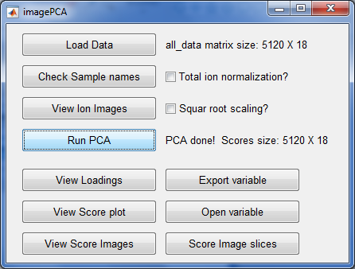
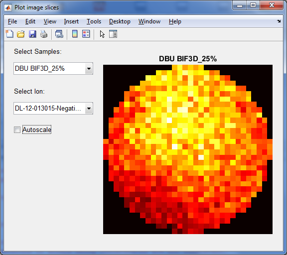
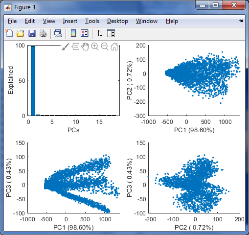
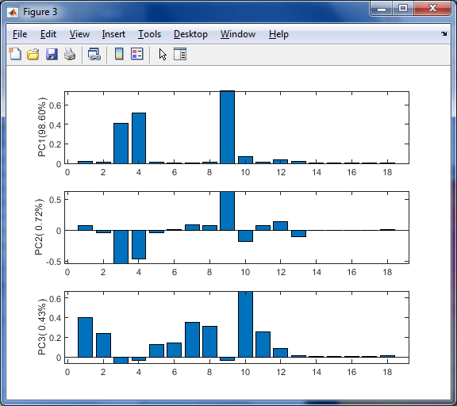
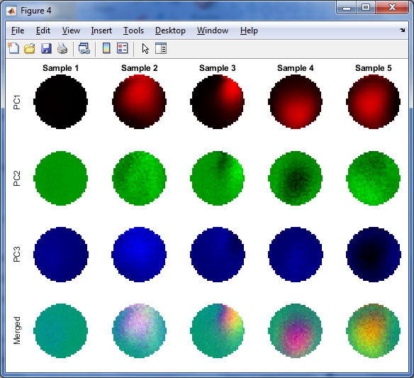

# Principle Component Analysis for Image
Time-of-flight secondary ion mass spectrometry (TOF-SIMS) is one of the most powerful chemical imaging techniques because it provides chemical images with a high spatial resolution, approximately 100nm, and detailed chemical information. The method scans the sample surface with a given spatial resolution and collects a mass spectrum at each point. Multivariate analysis methods such as the Principle Component Analysis (PCA) are often carried to reduce the data. Then the scores of the major principle components are used to reconstruct images of the sample surface. I wrote a matlab script with an user-friendly interface to ease the data analysis of TOF-SIMS data. Here we showcase some screenshot of the app.

## Software Intergace
Here is the main menu of the app:

It could reconstruct an image from the intensities of a selected mass peak:

Or merge the data of many samples, do the PCA analysis and show the PCA result:

Here is a composite image of the reconstructed images. The scores of the three major principle components (PC1 to PC3) are rendered red, blue and green separately, then merged in to one RGB image (bottom line). 

