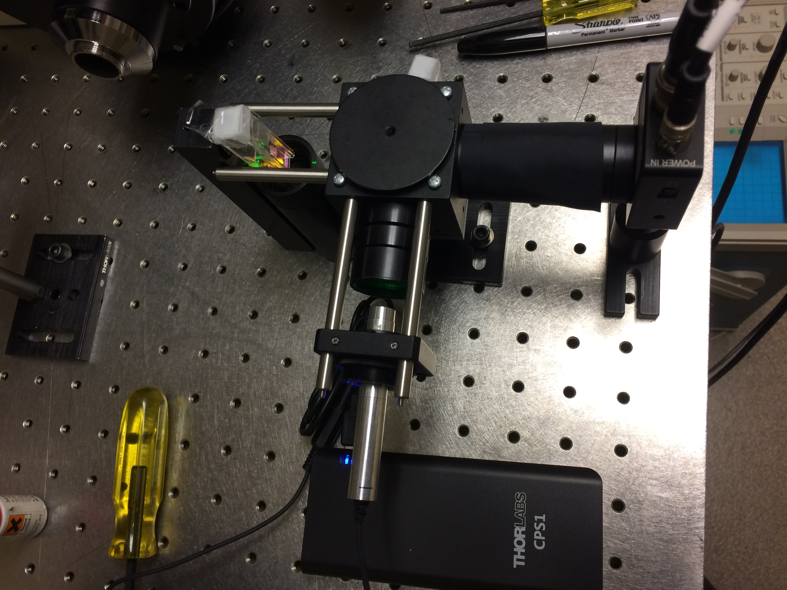
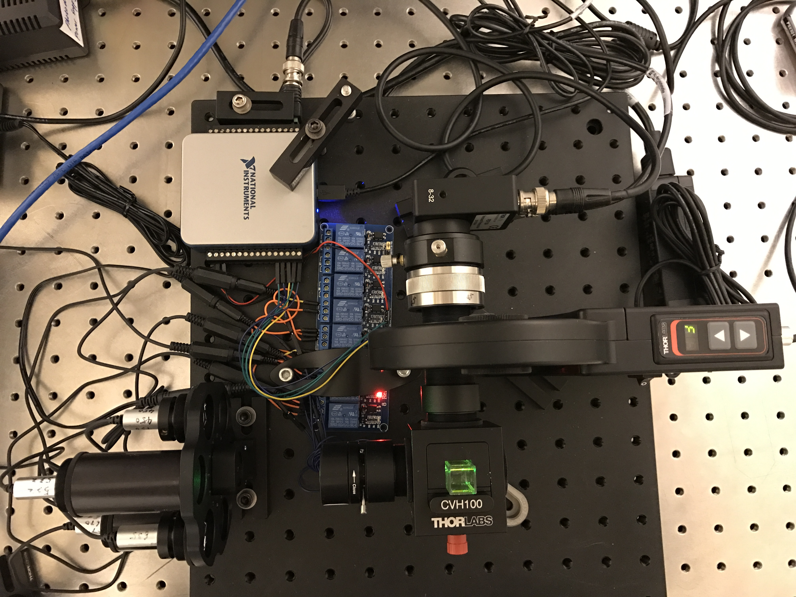
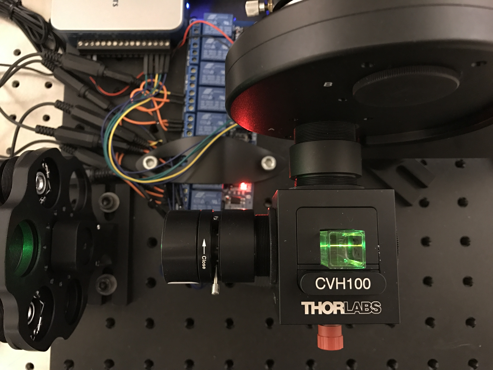
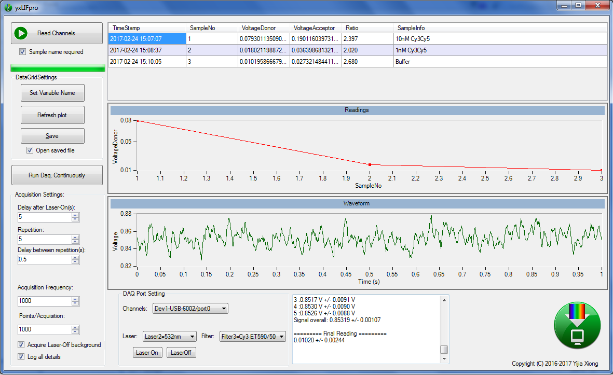
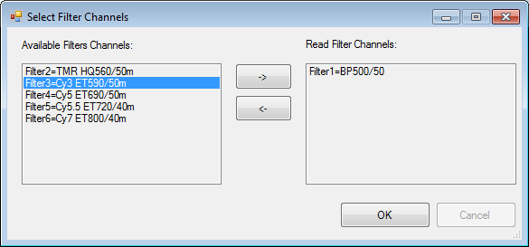
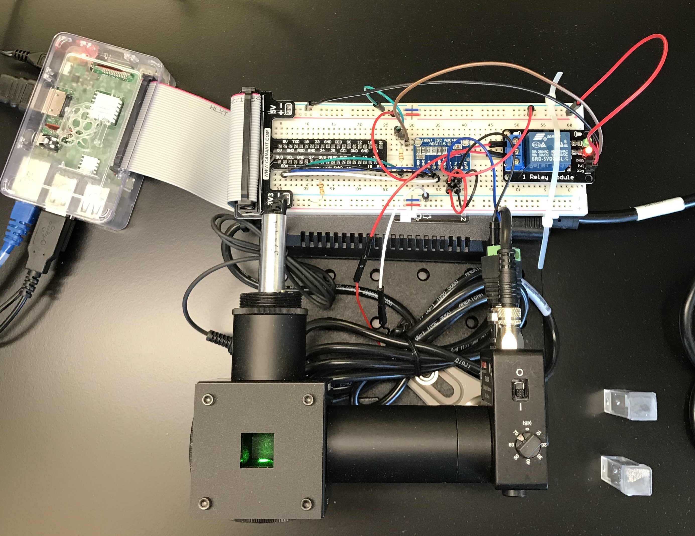
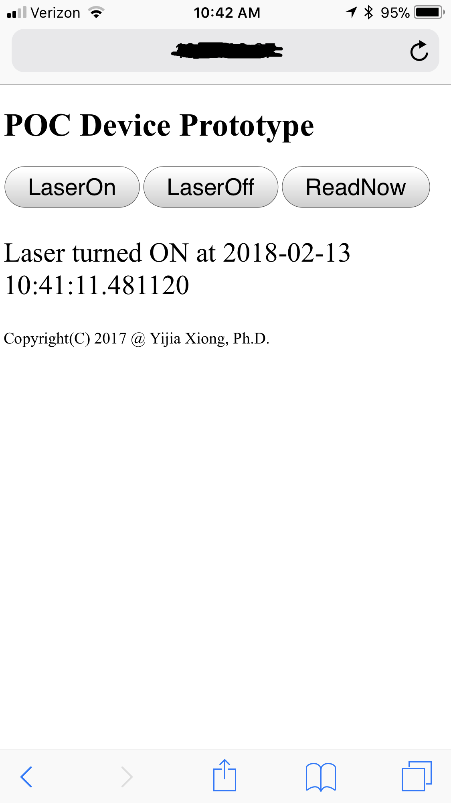
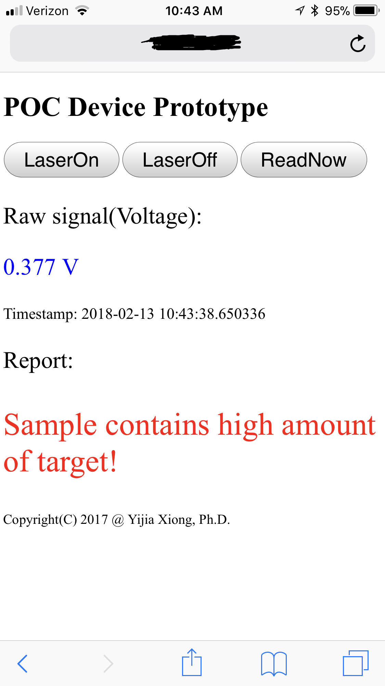

# Laser-Induced Fluorescence (LIF) Detection System

Welcome to the realm of pathogen detection.  At the heart of our endeavor lies a visionary aspiration: the creation of a portable, point-of-care device capable of on-site pathogen detection. Here I am showcasing our Laser-Induced Fluorescence (LIF) Detection System prototypes and software.

## Hardware Innovations

### Minimal LIF Setup
Here is the humble beginnings — a minimal LIF setup poised for greatness. Note the CPS1 battery pack provides portability:

### Advanced LIF System
Progressing to grandeur, we present an improved LIF system. Multiple lasers are built on a manual wheel, coupled with an automatic filter wheel controlled by the data acquisition program:

A closer look reveals some details:

## Software Mastery

Our software was written in VB.net. Here is a screenshot of the main GUI of the software:

The combination of the laser and the fluorescence wavelength (called channel) could be easily selected:

## Empowering Connectivity

We also created a LIF prototype with the capability to interface with smartphones. A webpage-based interface enables a smartphone to control the laser activation and data retrieval:

Here are the screenshots of the app on a smartphone.

