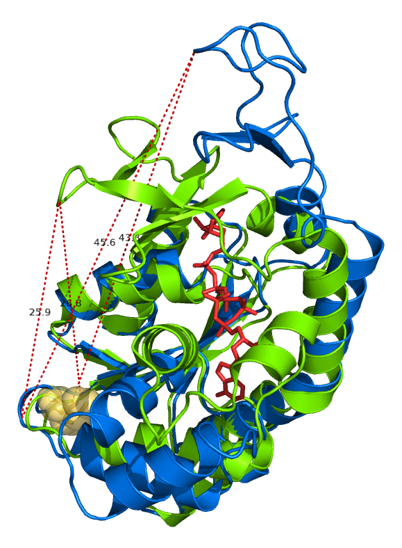

# Visualization of Proteins

Here is a gallery of the visualization of some proteins I have studied. The visualization was created by using either Pymol or Swiss PDB viewer. Some structures were exported as POV model and further rendered with ray tracing program POVRay.

#### Cartoon Model of Calmodulin binding to Calcium
Calmodulin was shown as a cartoon model with Ca2+ ions shown as grey spheres.

#### Calmodulin binding to a target peptide Ryanodine Receptor 

#### Calmodulin binding to another target peptide M13
This visualization was rendered by POVray.

#### A EGFP fused to M13 sequence binds to Calmodulin
This structure was an illustrative cartoon of the structure. It is created using the program pymol.

#### Overlaped structures of Adenylate Kinase with/without binding to the substrate analog AP5'A
The red stick model represents the substrate analog AP5'A. The visualization also incluldes a few measurements of the distance between residuals VAL148 to GLU 75 or CYS77. CYS 77 was rendered as yellow spheres.

#### Human Serum Albumin
Human Serum Albumin (HSA) structure with all disulfide bonds highlighted as orange sticks. The tryptophan was also highlighted as red sticks. HSA is an all alpha helix protein. The alpha helice were colored by HSA's subdomains(IA,IB,IIA,IIB,IIIA and IIIB).

#### Methionine Sulfoxide Reductase A
 Structure of the Methionine Sulfoxide Reductase A with enzyme activity center rendered as spheres.

#### Calcium ATPase 
The structure of Calcium ATPase with all Tyrosines rendered as spheres. This picture was also rendered with POVray with background and clouds added.

