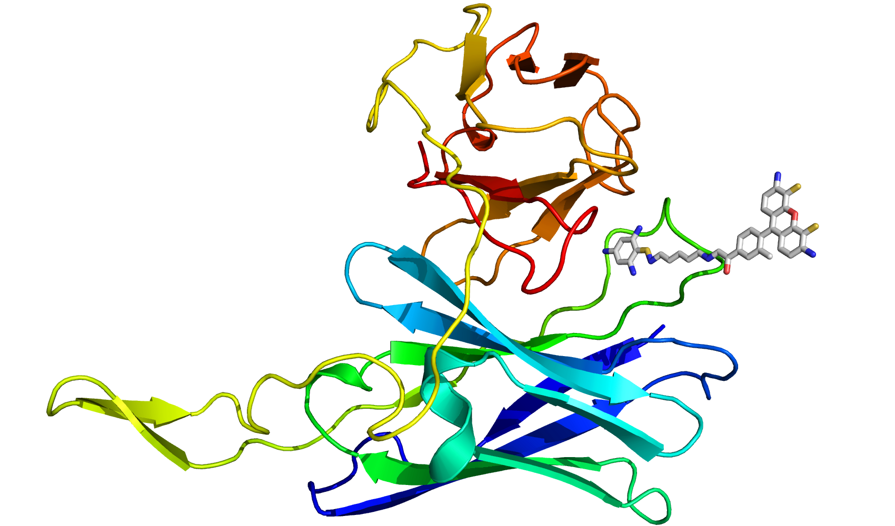
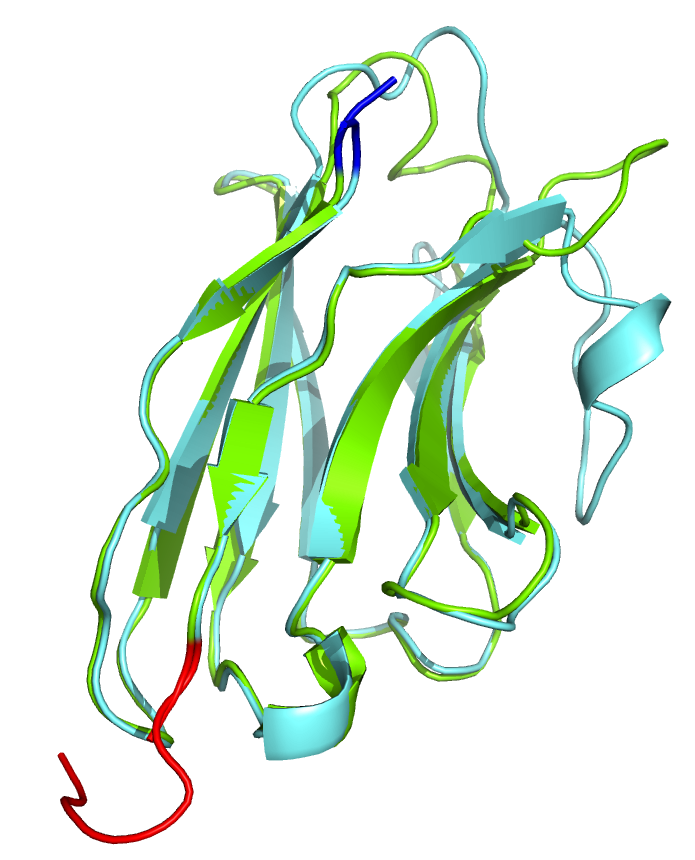

# Homology Modeling of Single Chain Variable Fragment

A single-chain variable fragment (scFv) is a fusion protein of the variable regions of the heavy (VH) and light chains (VL) of immunoglobulins, connected with a short linker peptide. ScFv retains the specificity of the original immunoglobulin but can be produced in bacteria culture. 

We have created a few scFvs for our research project. However their crystal structures were not available. Instead, homology modeling was used to create structures for them.

#### Homology structure of scFv against TNT 
Here is the structure of TNT-scFV binding to a fluorescent TNT analog, TNB-Alexa488. The TNT analog was shown as stick model.

#### Overlapped structrues of two single domain antibody (sdAb) against EA1 toxin
A single-domain antibody (sdAb) is an antibody fragment consisting of a single monomeric variable antibody domain.

Two sdAbs were created for our project to detect a toxin, EA1. Here their structrues were overlapped to show the similarity and subtle difference between them.
