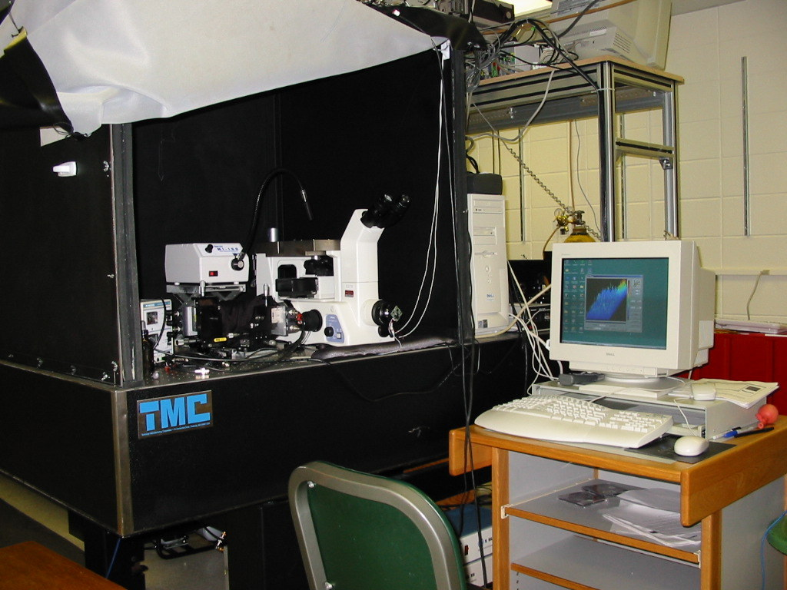
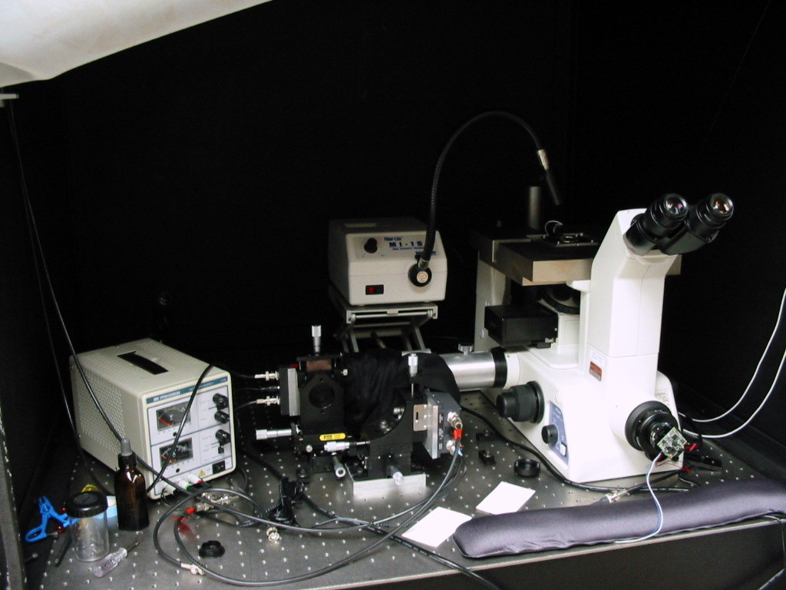
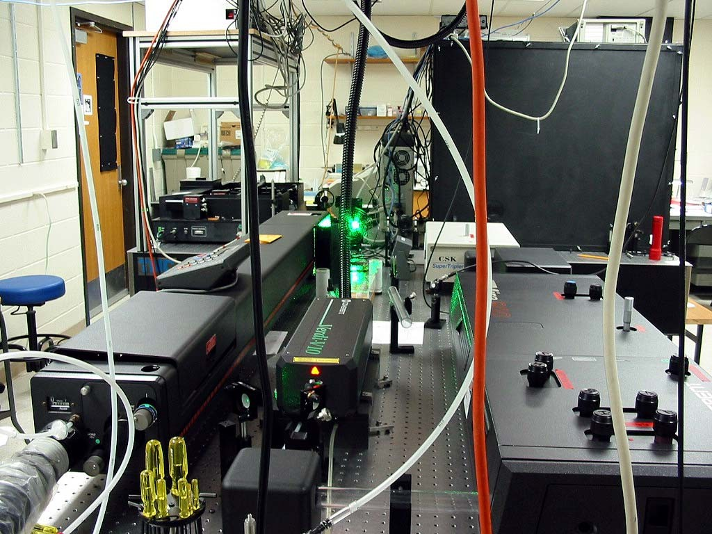
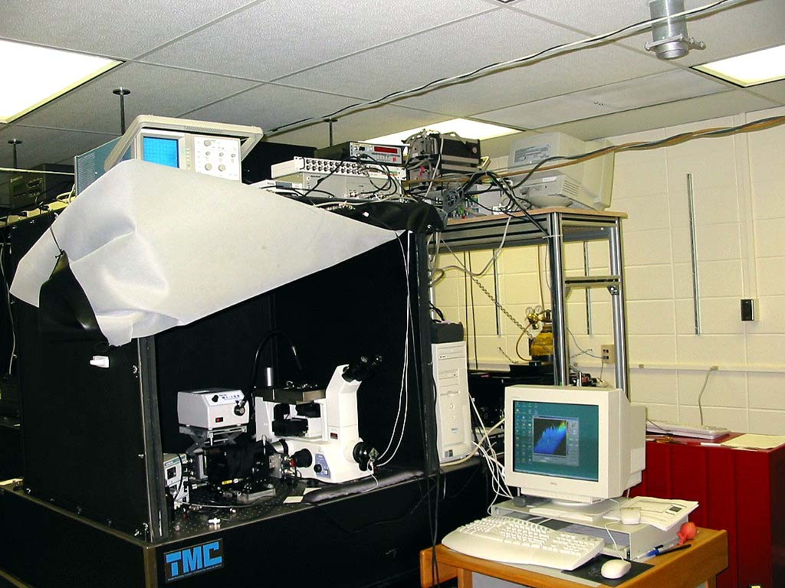
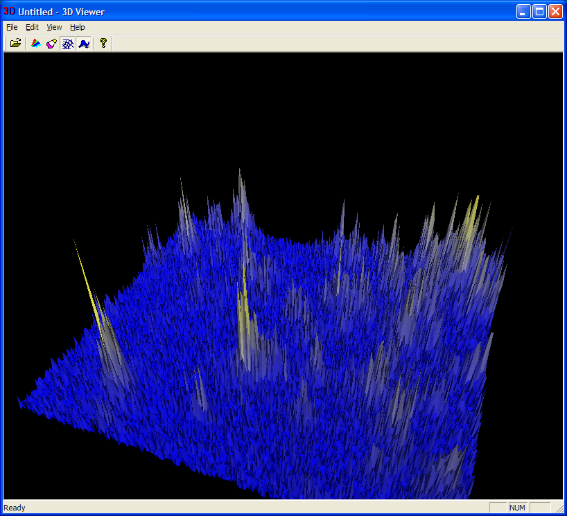
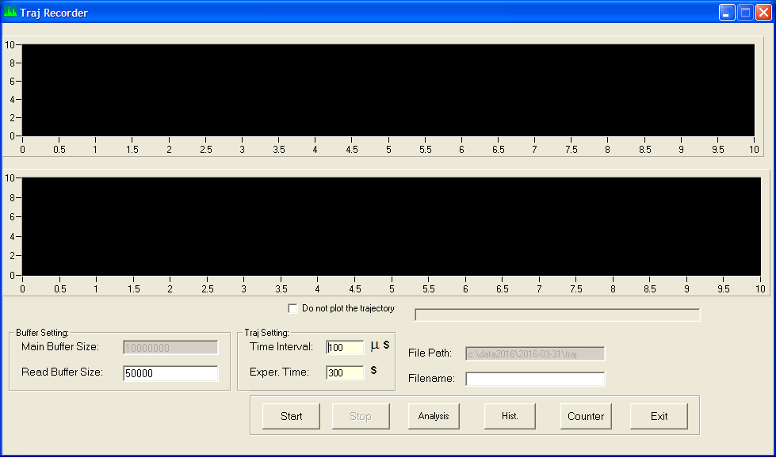
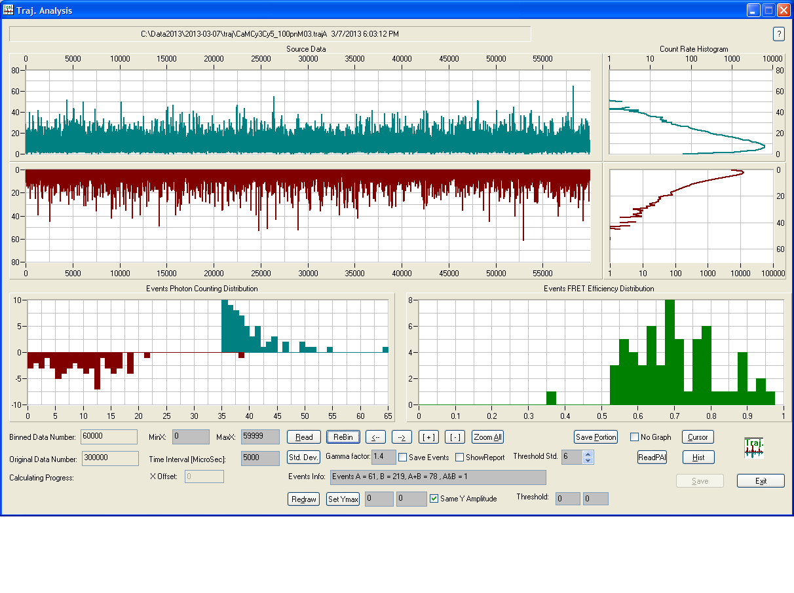

# Single Molecule Spectroscopy (SMS) System
A single molecule fluorescence microscopy system was built at Kansas University. I have set up the hardware and wrote the program for hardware control, data acquisitation and data analysis. 

## Hardware
The core of the SMS setup was a Nikon TE300 inverted microscope. Everything else was built on the optical table.

Two avalanche photodiodes were used as the detectors. To minimize the background of the ambient light, they were kept in a black box. Here is a picture of the detection parts in the black box.

The excitation came from a couple of large lasers. Single molecule detection really just needs low power lasers. However,  we already have these overkilling monsters in the lab. So we utilized them to save some bucks :). The lasers were attenuated quite a bit before sending to the microscope. 

Here is a picture of the lasers and the optics/mounts sit outside of the box.

The fluorescence came from single molecules was collected through the objective lens, filtered through an emission filter form Chroma Technology and detected by a pair of SPCM-AQR-14 avalanche photodiodes(APDs). These APDs located to the left of the microscope and were covered by black cloth to further reduce background light. The signal generated by the APDs was a train of TTL level pulses. They were recorded by a high speed counter card(NI6602) from National Instrument. The sample slide was scanned to acquire an image of the single molecules. The scanner was controlled by a NI6052E multifunction data acquisitation card. 

The controller and data acquisition breakbox were on the top of the blackbox. There was also an oscilloscope for signal monitoring.

## Software
Here is a screenshot of the controller software for the single molecule microscope system. An image with single molecules is shown on the screen.

I also wrote a program to show the 3D rendering of the data.

Next, user can choose a molecule, move the stage to that position and record a time resolved fluorescence trajectory of single molecule fluorescence. Two-channel trajectory can be collected simutaneously for single molecule Forster resonant energy transfer (smFRET) research.

Here is the screenshot of the software I wrote to analyze the smFRET trajectory.

