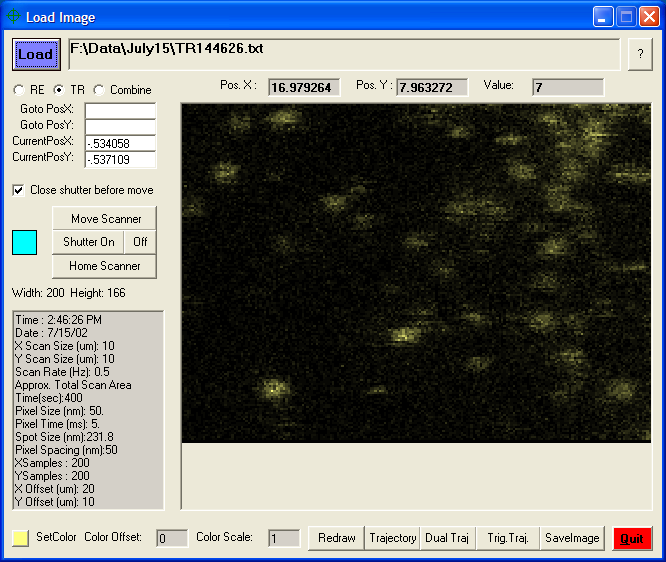
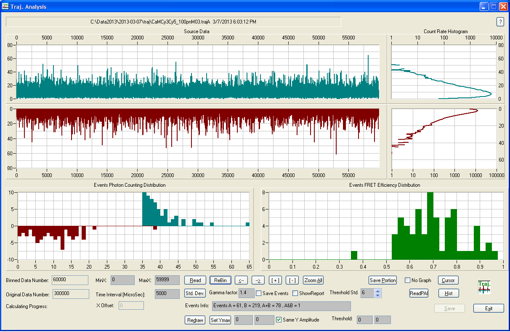

# Single Molecule Spectroscopy System
I built a single molecule fluorescence microscopy system, including setting up the hardware and 
writting all the programs to collect and analyze the data. 
## Hardware
This setup was built on a Nikon TE300 inverted microscope. The microscope is essentially just a 
base with one 100X oil-immersion objective (S Fluo100, Nikon, Tokyo, Japan). Everything else was
 built on the optical table.

Since the detectors are super sensitive, they and the microscope were kept in a black box to minimize 
the background caused by the ambient light. Here is a picture of the detection parts in the black box.

 The excitation came from a couple of large lasers. Single molecule detection really just need low 
 power lasers. However we happened to have these overkilling monsters in the lab so we decided to 
 save some bucks :). The lasers were attenuated quite a bit before sending to the microscope. 
 Here is a picture of the lasers and the optics/mounts sit outside of the box.

The fluorescence from single molecules was filtered through an emission filter form Chroma Technology 
and detected by a pair of SPCM-AQR-14 avalanche photodiodes(APDs). These APDs located to the left 
side of the microscope and were covered by black cloth to further reduce background noise. The signal 
generated by the APDs was a train of TTL level pulses. They were recorded by a high speed counter 
card(NI6602) from National Instrument. The slide need to be scanned to acquire an image of the 
single molecules. The scanner was controlled by a NI6052E multifunction data acquisitation card. 
The controller and data acquisition breakbox were on the top of the blackbox. There was also an 
oscilloscope for signal monitoring.

## Software
Here is a screenshot of the controller software for the single molecule microscope system. 

An image with single molecules is shown on the screen. I also wrote a program to show the 3D 
rendering of the data.

Next, user can choose a molecule, move 
the stage to that position and record a time resolved fluorescence trajectory of single molecule 
fluorescence.
Two-channel trajectory can be collected simutaneously for single molecule Forster resonant energy 
transfer (smFRET) research.

Here is the screenshot of the software I wrote to analyze the smFRET trajectory.
