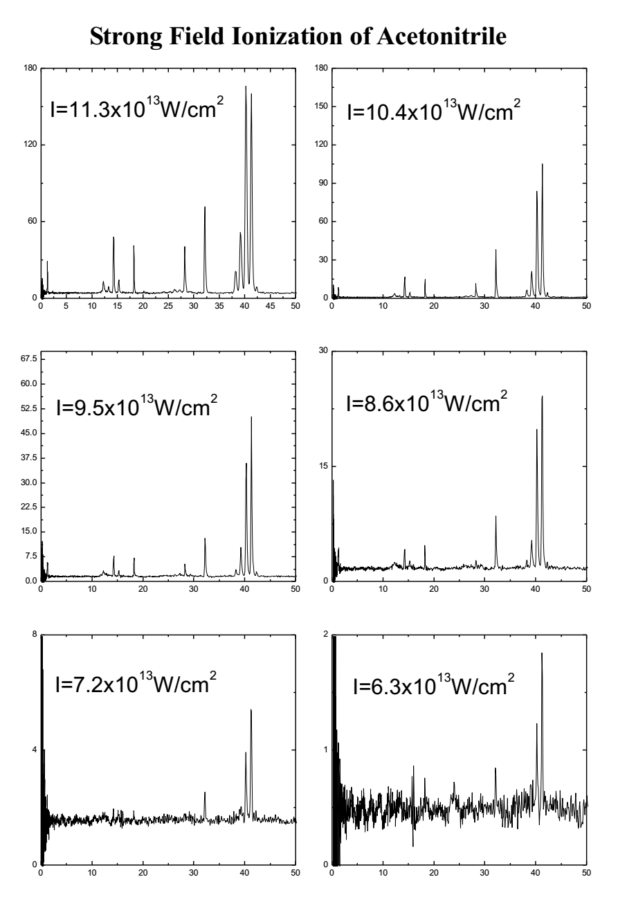
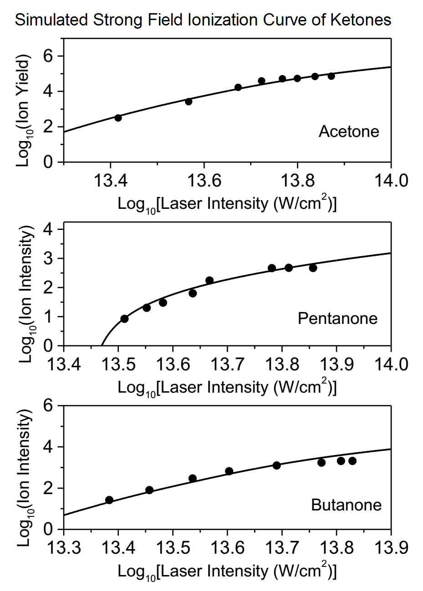

# Strong Field Ionization Time-of-Flight System
This system was built to study the strong field the ionization of molecules under strong field created by femtosecond laser. The system was based on a home-built time-of-flight mass spectrometer. The control program was written in Borland C++ and run under DOS enviroment. 

Here is the mass spectrometer:

The amplified femtosecond laser system was kept in a cleanroom.  Laser beam was provided through the windows (visible in the picture above).  Here is a view of the laser system in the cleanroom:

### Sample Result (from my thesis)
A few representive mass spectra of Acetonitrile under different strong-field caused by femtosecond laser.

The simulated result calculated by my program showed a good fit of the experimental data.

