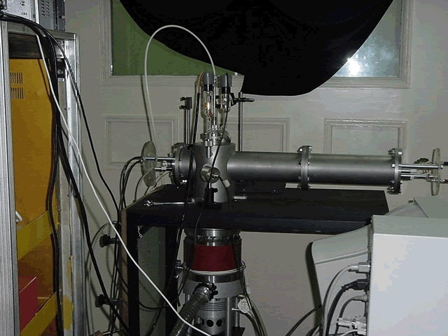
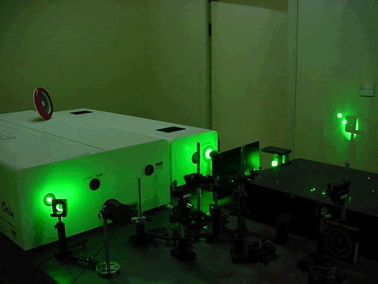

# Strong Field Ionization Time-of-Flight System
This system was built to study the strong field the ionization of molecules under strong field 
created by femtosecond laser. The system was based on a home-built time-of-flight mass spectrometer.
Here is the mass spectrometer:

The amplified femtosecond laser system was kept in a clean room behind the mass spectrometer, with 
windows that will be opened when the laser is in-use. Here is a picture of the laser system in the 
cleanroom:

The control program was written in Borland C++ and run under DOS enviroment. Time-of-flight mass 
spectroscopy required a high speed data acquisition card which took over all the resource of the 
computer. So... sorry, no TSR program (terminate and stay resident program) and no screenshots 
is available for this system.